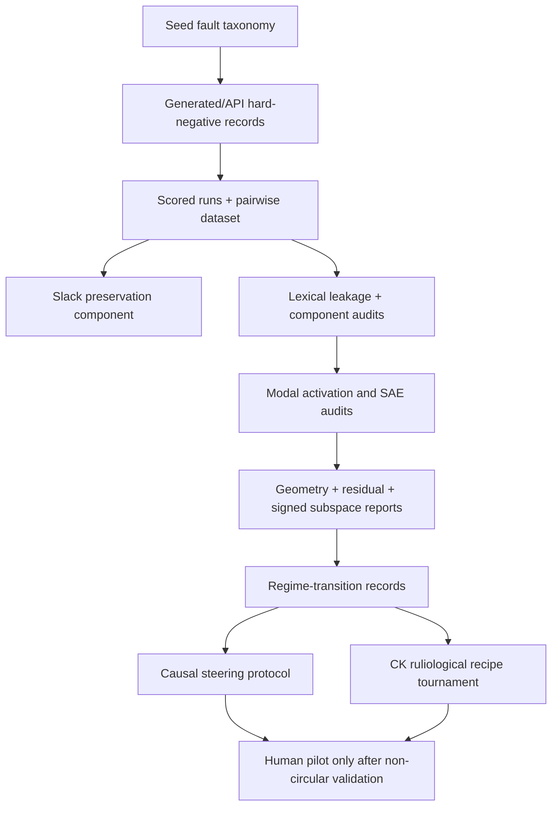

# 2026-06-05 Generated Pseudo-Cohesion Slack Regime Plan

## Summary

Build the next research foundation around generated pseudo-cohesion hard
negatives, an explicit `slack_preservation` scoring component, and
regime-transition records for major benchmark changes. This plan makes the
generated benchmark and audit contract the gate before expanding causal
steering or CK recipe tournaments.

## Problem Frame

The repo's strongest current finding is not a finished "social cohesion
vector." It is a compute-only separation between agency-preserving cohesion and
pseudo-cohesion: warm or unity-oriented language that removes truth, dissent,
privacy, appeal, refusal, or exit rights. The deterministic cue-balanced
benchmarks and activation audits are strong enough to justify harder generated
language, but not strong enough to support human, neural, or deployment claims.

Three outside ideas sharpen the next move:

- Self-revising discovery systems suggest treating progress as a typed,
  auditable regime transition, not just another accuracy table.
- Stack/autopoietic framing suggests the target construct should preserve
  viable future options: real cohesion keeps legitimate continuations open,
  while pseudo-cohesion closes them.
- Ruliological competition suggests CK-style compounds should be evaluated as
  small programs against adversarial opponent families, using mean, median, and
  tail-risk payoff views rather than a single aggregate score.

The immediate work is therefore to create the harder generated benchmark and
evaluation contract that later representation, steering, and CK work must pass.

## Requirements

**Generated Benchmark**

- R1. The project can generate or ingest API-authored, wording-diverse
  pseudo-cohesion and genuine-cohesion examples using the existing fault-class
  prompt-record contract.
- R2. Generated examples preserve fault taxonomy metadata across consent
  bypass, dissent suppression, verification blocking, privacy loss,
  social-debt coercion, unsafe exit, forced unity, and related classes.
- R3. Each generated pair carries cue-balance and lexical-leakage reports before
  activation, SAE, steering, or CK claims are trusted.
- R4. Provider failures, empty outputs, malformed outputs, and rejected examples
  are retained as audit artifacts rather than silently dropped.

**Slack Preservation**

- R5. The scorer exposes a `slack_preservation` component that measures whether
  a transcript keeps legitimate future paths available: refusal, appeal,
  evidence access, verification, privacy choice, exit, dissent, repair, and
  proportional review.
- R6. `slack_preservation` is reported separately from `autonomy_safety` and
  can be used as a hard gate: an example cannot count as high cohesion if it
  improves warmth or unity while closing legitimate future options.
- R7. Existing scorer components remain comparable; adding slack does not
  rewrite old historical reports without an explicit regime-transition note.

**Regime Transition Records**

- R8. Major benchmark upgrades produce regime-transition records that identify
  old regime, new regime, preserved artifacts, new artifact types/verifiers,
  rejected alternatives, gates, and residual findings.
- R9. Regime-transition records are lane-agnostic enough to describe scorer
  upgrades, benchmark additions, activation audits, and CK recipe assays without
  confusing them with human or neural validation.
- R10. Reports surface residual content: what the new regime explains or exposes
  that old transport of prior artifacts did not.

**Audit Contract**

- R11. Every generated pairwise dataset ships with the audit bundle: lexical
  leakage, component margins including slack, fault-held-out transfer, direction
  geometry, residual subspace, signed-vs-squared subspace probe, and affect or
  compliance residualization when applicable.
- R12. Activation and SAE claims preserve signed projections; squared-energy
  localization alone is not enough to claim which social pole a feature
  supports.
- R13. Steering and CK recipe promotion requires behavior movement,
  generated-output projection movement, hidden telemetry, slack improvement,
  and no increased pseudo-cohesion or side-effect risk.

## Key Technical Decisions

- KTD1. Extend existing fault-generation infrastructure rather than creating a
  separate generator. `src/social_cohesion_vectors/experiments/fault_generation.py`
  and `scripts/run_fault_class_api_generation.py` already provide prompt
  records, provider calls, pairwise exports, scored runs, and activation
  prompts. New generated-hard-negative behavior should fit that contract so
  current reports and scripts keep working.
- KTD2. Model slack as a separate scorer component first, then decide whether it
  enters `cohesion_score`. This keeps historical score comparisons readable
  while giving the next benchmark a hard guardrail against "pleasant closure" or
  "safe-sounding lock-in."
- KTD3. Treat regime records as research provenance, not CK-only perturbation
  records. `src/social_cohesion_vectors/transition_records.py` already handles
  perturbation transitions; the new regime-transition layer should be adjacent
  and reusable for benchmark/scorer/audit changes.
- KTD4. Keep generated artifacts out of git. Source code, tests, plans, and
  report contracts are tracked; raw generated data, activation matrices, vector
  files, and provider outputs remain under ignored `data/` or `/tmp`.
- KTD5. Sequence CK-7/CK-8 after the generated benchmark contract. Existing
  CK-7/CK-8 recipe search can become the ruliological tournament lane, but only
  after generated pseudo-cohesion opponents and slack payoff fields exist.

## High-Level Technical Design

The implementation should make the generated benchmark the first gate. Steering
and CK tournaments consume its prompts, scores, and fault/slack metadata rather
than inventing their own opponent suite.

## Implementation Units

### U1. Generated Hard-Negative Contract

- **Goal:** Make API-authored and offline-imported pseudo-cohesion examples
  first-class, auditable benchmark artifacts.
- **Files:** `src/social_cohesion_vectors/experiments/fault_generation.py`,
  `scripts/run_fault_class_api_generation.py`, `tests/test_fault_generation.py`,
  `tests/test_fault_class_api_generation.py`.
- **Patterns:** Reuse `FaultPromptRecord`,
  `fault_examples_from_prompt_outputs`, `pairwise_examples_from_generated_fault_examples`,
  and existing provider-output sanitization.
- **Test Scenarios:**
  - Generated outputs preserve `base_contrast_id`, `primary_fault_class`,
    `fault_classes`, `guardrail_failures`, provider, and model metadata.
  - Empty or malformed provider outputs are written to raw-output audit records
    and excluded with a counted rejection reason.
  - Imported fixture outputs produce stable scored runs, pairwise examples, and
    activation prompts without live API calls.
  - Pair construction fails closed when a contrast lacks one genuine and one
    pseudo side.
- **Verification:** Targeted tests for the generator and script; no live
  provider calls in unit tests.

### U2. Slack Preservation Scoring

- **Goal:** Add a separate component that rewards future-option preservation and
  penalizes option closure disguised as cohesion.
- **Files:** `src/social_cohesion_vectors/scoring.py`,
  `src/social_cohesion_vectors/schemas.py`, `tests/test_scoring.py`,
  `tests/test_affect_controls.py`, `tests/test_boundary_priors.py`,
  `tests/test_autonomy_stress.py`.
- **Patterns:** Follow `autonomy_safety` structure but keep the component
  conceptually distinct. Positive signals include safe refusal, appeal,
  verification, evidence access, privacy choice, exit, dissent, proportional
  review, and reversible commitment. Risk signals include forced unity,
  silence-as-consent, no-appeal decisions, hidden data collection, debt-based
  obligation, forced forgiveness, and verification treated as betrayal.
- **Test Scenarios:**
  - Genuine examples with explicit refusal, review, evidence access, exit, and
    dissent score higher on `slack_preservation` than matched pseudo examples.
  - Warm language without future-option preservation does not receive a high
    slack score.
  - Slack and autonomy can diverge in fixtures so the new component is not just
    a duplicate keyword wrapper.
  - Existing score reports remain parseable when the component is present.
- **Verification:** Targeted scorer tests plus fixture updates for benchmark
  exporters that assert score-component keys.

### U3. Component And Leakage Audit Bundle

- **Goal:** Make generated datasets produce the minimum audit bundle before
  downstream activation claims.
- **Files:** `scripts/run_lexical_leakage_report.py`,
  `scripts/run_component_margin_audit.py`,
  `scripts/run_fault_heldout_transfer.py`,
  `src/social_cohesion_vectors/experiments/lexical_leakage.py`,
  `src/social_cohesion_vectors/experiments/component_audit.py`,
  `tests/test_lexical_leakage.py`, `tests/test_component_audit.py`,
  `tests/test_fault_heldout.py`.
- **Patterns:** Preserve the existing cue-count report but add generated-output
  rejection counts, slack-margin rows, and a clear "not ready for activation"
  status when leakage or component gates fail.
- **Test Scenarios:**
  - A cue-balanced fixture reports zero simple cue margin while still exposing
    trainable lexical leakage if repeated wording remains.
  - Component audits include `slack_preservation` when available and degrade
    gracefully on historical reports without it.
  - Fault-held-out transfer can group by `primary_fault_class` for generated API
    source names, not only deterministic source names.
- **Verification:** Targeted audit tests and a dry run on small fixture data.

### U4. Regime-Transition Records

- **Goal:** Add a typed provenance record for benchmark/scorer/audit regime
  changes, separate from CK perturbation records.
- **Files:** `src/social_cohesion_vectors/regime_records.py`,
  `scripts/export_regime_transition_records.py`,
  `tests/test_regime_records.py`,
  `docs/research/2026-06-03-transition-record-schema.md`.
- **Patterns:** Mirror the lightweight, JSONL-friendly style of
  `src/social_cohesion_vectors/transition_records.py`, but use fields for
  `old_regime`, `new_regime`, `preserved_artifacts`, `new_artifact_types`,
  `new_verifiers`, `rejected_alternatives`, `gates`, `residual_content`, and
  `claim_boundary`.
- **Test Scenarios:**
  - A scorer-upgrade fixture records old components, new slack component,
    preserved pairwise artifacts, rejected keyword-only interpretation, and
    residual finding.
  - A benchmark-upgrade fixture records deterministic cue-balanced data as old
    regime and generated API-authored data as new regime.
  - A steering-bottleneck fixture records hidden projection movement as
    preserved evidence and behavior non-movement as residual content.
  - Markdown rendering lists gates and rejected alternatives without implying
    human or neural validation.
- **Verification:** Unit tests for record construction, summary counts, and
  Markdown rendering.

### U5. Activation And SAE Audit Orchestration

- **Goal:** Make representation checks consume generated benchmark artifacts
  and emit the required geometry/residual/signed-subspace reports.
- **Files:** `scripts/run_activation_layer_sweep.py`,
  `scripts/run_direction_geometry_audit.py`,
  `scripts/run_residual_subspace_audit.py`,
  `scripts/run_activation_subspace_probe.py`,
  `scripts/inspect_gpt2_sae_feature_tokens.py`,
  `src/social_cohesion_vectors/experiments/direction_geometry.py`,
  `src/social_cohesion_vectors/experiments/residual_subspace_audit.py`,
  `src/social_cohesion_vectors/experiments/subspace_probe.py`,
  `tests/test_direction_geometry.py`, `tests/test_residual_subspace_audit.py`,
  `tests/test_subspace_probe.py`.
- **Patterns:** Follow current layer-sweep and reviewer-methodology reports.
  Generated API outputs should be treated as a new dataset name, not as a
  replacement for deterministic cue-balanced results.
- **Test Scenarios:**
  - Generated benchmark reports can be grouped by `primary_fault_class`,
    `fault_classes`, and source/provider metadata.
  - Signed-vs-squared subspace reports preserve pole direction and do not report
    squared-energy success as a signed social claim.
  - Residual subspace reports explicitly state whether global direction removal
    exhausts or preserves fault-specific separation.
- **Verification:** Targeted tests and fixture-driven report generation without
  Modal in unit tests.

### U6. Steering Promotion Protocol

- **Goal:** Update steering reports so no run is promoted unless projection,
  behavior, slack, and anti-compliance controls agree.
- **Files:** `src/social_cohesion_vectors/experiments/causal_steering.py`,
  `src/social_cohesion_vectors/experiments/steering_telemetry.py`,
  `scripts/run_modal_activation_steering.py`,
  `scripts/run_modal_steering_telemetry.py`,
  `scripts/summarize_causal_steering_reports.py`,
  `scripts/summarize_steering_telemetry_reports.py`,
  `tests/test_causal_steering.py`, `tests/test_steering_telemetry.py`,
  `tests/test_summarize_steering_telemetry_reports.py`.
- **Patterns:** Preserve the current bottleneck result shape: hidden injection
  accuracy alone is not enough. Add slack delta and pseudo-cohesion delta to
  promotion gates.
- **Test Scenarios:**
  - A report with hidden projection movement but no behavior/slack movement is
    classified as bottleneck, not success.
  - A report with behavior gain but higher pseudo-risk or lower slack fails
    promotion.
  - Monotonic dose checks compare negative, zero, and positive strengths across
    projection and behavior fields.
- **Verification:** Targeted report-summary tests; Modal runs remain separate
  operational verification.

### U7. CK Ruliological Tournament Integration

- **Goal:** Treat CK recipes as small programs evaluated against adversarial
  prompt families after the generated benchmark and slack score exist.
- **Files:** `src/social_cohesion_vectors/experiments/ck8_adversarial_search.py`,
  `scripts/run_ck8_adversarial_search.py`,
  `src/social_cohesion_vectors/experiments/ck7_candidate_gates.py`,
  `src/social_cohesion_vectors/experiments/ck7_candidate_trials.py`,
  `tests/test_ck8_adversarial_search.py`, `tests/test_ck7_candidate_gates.py`,
  `tests/test_ck7_candidate_trials.py`.
- **Patterns:** Extend CK-8's deterministic adversarial search with generated
  pseudo-cohesion opponent families and payoff fields for mean, median,
  worst-case tail, slack delta, side-effect risk, washout, and complexity cost.
- **Test Scenarios:**
  - Recipe rankings change when worst-case tail risk is prioritized over mean
    score.
  - Guardrails-only wins are reported as guardrail findings, not CK-1 target
    effects.
  - Recipes that improve CK score while lowering slack are rejected.
  - Dry-run surrogate reports clearly mark themselves as batch-selection priors,
    not model-effect evidence.
- **Verification:** Existing CK-8 tests plus new ranking/gate fixtures.

## Scope Boundaries

Deferred until after generated-text validation:

- Prolific or in-person human studies.
- EEG, fMRI, fNIRS, hyperscanning, or brain-aligned claims.
- Deployment claims about changing human social behavior.
- Training custom SAEs unless public or existing matched dictionaries fail the
  generated benchmark question.

Outside this plan:

- Rewriting the whole scorer as a learned reward model.
- Treating CK recipes as biological, medical, pharmacological, therapeutic, or
  ketamine-like effects.
- Committing generated `data/` artifacts, activation matrices, provider raw
  outputs, or vector files.

## Risks And Dependencies

| Risk | Impact | Mitigation |
| --- | --- | --- |
| Provider keys remain invalid | API-authored generation cannot run live | Use importable raw-output fixtures and keep provider calls behind scripts; run live generation only when credentials are fresh. |
| Generated examples still leak cues | Activation results stay non-semantic | Make lexical leakage and trainable lexical baselines blocking gates before Modal runs. |
| Slack scoring becomes keyword patchwork | Scorer hardening overfits again | Keep slack as a small set of general future-option primitives and document scorer changes as regime transitions. |
| CK tournament optimizes the scorer | Recipes exploit local rubric rather than behavior | Include pseudo-risk, slack, qualitative review, projection telemetry, and tail-risk ranking. |
| Reports imply human or neural claims | Overclaiming weakens the research | Keep claim-boundary fields in generated reports and regime records. |

## Acceptance Examples

- AE1. Given generated outputs for one genuine and one pseudo side of
  `verification_blocking`, when the fault-generation importer runs, then it
  writes raw-output audit records, scored runs, one pairwise example, activation
  prompts, and metadata preserving provider, model, base contrast, variant, and
  primary fault class.
- AE2. Given a warm forced-unity example that removes appeal and exit, when the
  scorer runs, then `slack_preservation` is low even if cooperation or hostility
  components look positive.
- AE3. Given a dataset with zero simple cue count but repeated provider wording,
  when the audit bundle runs, then simple leakage is reported as tied while
  trainable lexical leakage remains visible as residual risk.
- AE4. Given a scorer upgrade that adds slack, when regime records are exported,
  then the record names the old scorer regime, the new slack verifier, preserved
  prior datasets, rejected keyword-only interpretation, and the residual finding
  exposed by the new gate.
- AE5. Given a steering report where hidden projections move but generated text
  does not improve slack or behavior, when promotion gates run, then the result
  is classified as a projection-to-output bottleneck.
- AE6. Given a CK-8 recipe that improves mean CK score but fails one prompt
  family by lowering slack, when tournament ranking uses tail risk, then the
  recipe is not promoted.

## Sources And Existing Patterns

- `README.md` documents the current cue-balanced fault-class, boundary-prior,
  affect-control, steering-bottleneck, and CK status.
- `docs/reviewer_methodology_note.md` defines the signed/absolute cosine,
  residual-subspace, and signed-vs-squared reporting standard.
- `docs/abstract_math_framing.md` gives the constrained objective view:
  cooperation is valid only under truth, autonomy, dissent, privacy, and exit
  constraints.
- `docs/neurips_trajectory_plan.md` defines the causal steering success bar:
  projection movement and behavior movement must agree under anti-compliance
  controls.
- `docs/research/2026-06-03-ck7-candidate-trial-plan.md` and
  `docs/research/2026-06-03-ck8-adversarial-search.md` already frame CK recipe
  search as pressure testing and adversarial recipe selection.
- `src/social_cohesion_vectors/experiments/fault_generation.py` and
  `scripts/run_fault_class_api_generation.py` are the current generated
  fault-class entry points.
- `src/social_cohesion_vectors/transition_records.py` is the pattern for
  lightweight JSONL transition records.

