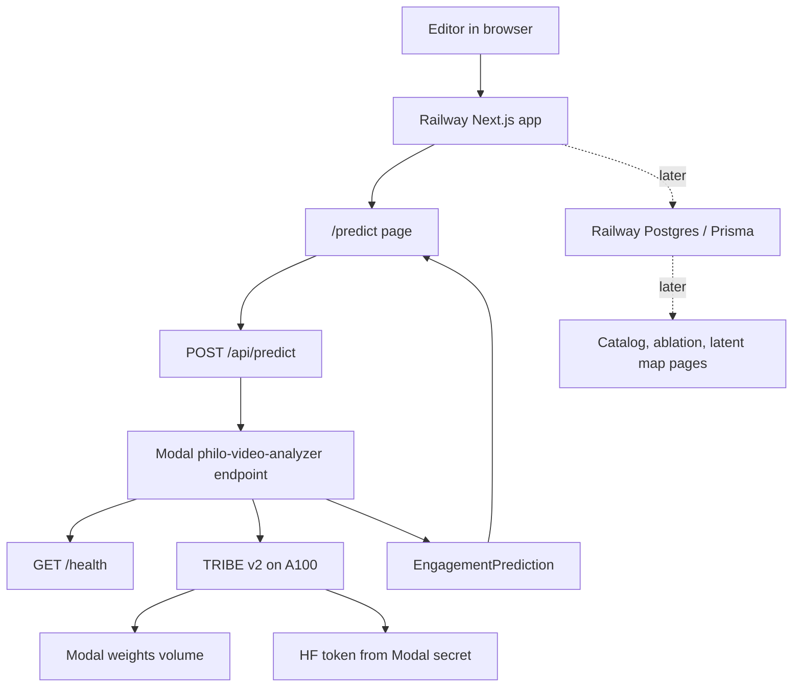

# Philo Video Brainlab Live App - Plan

## Goal Capsule

| Field | Value |
|---|---|
| Objective | Turn `philo-video-brainlab/` into its own live working app, with a Railway-hosted Next.js web service calling a philo-owned Modal GPU endpoint for video or caption scoring. |
| Success signal | A public Railway URL serves the philo app, `/predict` submits to `/api/predict`, the proxy calls a philo Modal endpoint, `/health` reports the Modal model state, and a sample score returns the `EngagementPrediction` contract. |
| Authority hierarchy | User request and repo instructions, then this plan, then existing code patterns in `src/social_cohesion_vectors/modal_app/functions/video_analyzer.py`, then provider CLI defaults. |
| Execution profile | Code implementation across the philo web app, philo Modal service, deployment config, and docs. Use a fresh branch from `origin/main`, run lint/type checks and targeted tests before commit, push a PR, and merge after a successful PR. |
| Stop conditions | Stop only for missing browser-auth steps, unavailable external secrets, Modal account limits, Railway project creation failure, or a contract change that would make the live app materially different from this plan. |
| Tail ownership | The implementing agent owns deploy, smoke tests, PR, and merge. The user owns browser-only Railway confirmation only if Railway requires an interactive account action. |

---

## Product Contract

### Summary

`philo-video-brainlab/` already contains the shape of the app: a Next.js predictor UI, a Modal service skeleton, Prisma schema, and scoring package.
The missing work is to make it independently deployable and to replace the philo Modal stub path with the working Modal/TRIBE pattern already proven by the root app.
The first live version should prioritize a real browser path from Railway to Modal over the full research pipeline, while keeping the data and ablation pieces ready for the next build.

### Problem Frame

GitHub Pages is the wrong primary host for this app because the philo app is not only static HTML.
It needs a server-side `/api/predict` proxy, environment variables, and eventually database-backed views.
Railway is already authenticated locally and can host the Next service, while Modal is already proven for the GPU endpoint and HF-gated TRIBE loading.

The current philo Modal code has useful domain structure but is not production-ready: `tribe_inference.py` always falls back to a stub, defaults to `facebook/tribe-v2` instead of the working `facebook/tribev2` model id, uses separate `modal.App` instances across modules, and marks predictions as `used_brain: true` even when the brain trajectory is synthetic.
The live app should reuse the root Modal analyzer's hard-won details: `.env`-backed Modal secrets, A100 default for TRIBE, the `tribev2` install preflight, a persistent weights volume, CORS, `/health`, and fallback semantics that honestly set `used_brain: false`.

### Requirements

**Live Web App**

- R1. `philo-video-brainlab/apps/web` must run as its own public Railway deployment, separate from the root `social-cohesion-vectors` static Railway service.
- R2. The deployed web app must serve the existing homepage and `/predict` flow without relying on GitHub Pages.
- R3. `/api/predict` must proxy to `MODAL_PREDICT_ENDPOINT` when configured and retain a transparent local fallback for local development.
- R4. The predictor UI must display the returned model version, target scores, `used_brain` state, and editor notes without changing the existing `EngagementPrediction` client contract.

**Modal GPU Endpoint**

- R5. The philo Modal endpoint must expose `GET /health` and `POST /` under a philo-specific app or label so it does not collide with the root `video-analyzer` deployment.
- R6. The endpoint must load TRIBE using the proven `facebook/tribev2` path, HF token secret handling, A100-compatible image, `tribev2` install preflight, and persistent weights volume.
- R7. If TRIBE or media ingestion fails, the endpoint may return a deterministic fallback trajectory, but the response must set `used_brain: false` and identify fallback in `model_version`.
- R8. The POST response must remain compatible with `philo-video-brainlab/apps/web/lib/types.ts`: `video_id`, `model_version`, `used_brain`, five targets, `latent_score`, and `editor_notes`.

**Railway, Env, and Data**

- R9. Railway deployment must use a new project or service created with an explicit `--new` or explicit project/service flags, because the working tree is currently linked to the root static site deployment.
- R10. Railway runtime env must include `MODAL_PREDICT_ENDPOINT` and `NEXT_PUBLIC_APP_NAME`; `DATABASE_URL` is allowed but must not block first live scoring unless a page actually reads the database.
- R11. The Prisma/Postgres path must be documented and kept deployable, but database-backed catalog views and ablation dashboards are deferred unless needed for the first live scoring experience.
- R12. The deployment docs must include exact Modal deploy, Railway deploy, env, health check, and smoke-test commands.

**Integrity and Claims**

- R13. The app must avoid claims that model activations prove real human behavioral or neural effects.
- R14. UI and docs must describe TRIBE scores as model-derived estimates and keep the ablation framing intact.

### Actors

- A1. Editor: opens the live Railway app and scores a draft video URL or caption before posting.
- A2. Local deploy agent: runs Modal and Railway CLI commands from the repo and verifies the live endpoints.
- A3. Reviewer: checks the PR for deployment safety, honest fallback semantics, and response-contract stability.

### Key Flows

- F1. Draft scoring: A1 opens Railway `/predict`, enters a `video_id` plus URL or caption, submits, the Next route posts to Modal, Modal returns an `EngagementPrediction`, and the UI renders bars plus editor notes.
- F2. Modal health: A2 deploys Modal, opens `https://<workspace>--philo-video-analyzer.modal.run/health`, and confirms `{ "ok": true, "model": "facebook/tribev2", "loaded": true | false }`.
- F3. Railway rollout: A2 deploys the philo root with `railway up philo-video-brainlab --path-as-root --new --name philo-video-brainlab`, sets env vars on the new service, redeploys, and curls the public app URL.
- F4. Fallback transparency: if HF access, TRIBE import, media download, or GPU load fails, the app still returns a response for UI testing but clearly reports `used_brain: false`.

### Scope Boundaries

**In Scope**

- Make the philo Next app deployable on Railway.
- Make the philo Modal endpoint deployable and browser-callable through the Next proxy.
- Reuse or port the root app's proven Modal/TRIBE implementation pattern.
- Keep Prisma/Postgres setup ready and documented.
- Verify live Railway and Modal URLs with curl and browser-level smoke tests.

**Deferred**

- Training the final engagement head from historical CSV or platform data.
- Replacing the heuristic engagement mapping with a validated learned model.
- Full catalog ingestion from YouTube, TikTok, Instagram, or competitor APIs.
- Dashboard pages for latent maps and creator comparisons.
- Human validation via Prolific, in-person, fMRI, EEG, fNIRS, or hyperscanning.

**Out of Scope**

- Resurrecting GitHub Pages as the primary host for the philo app.
- Shipping a claim that TRIBE activations alone establish real human effects.
- Moving the root static site off its current Railway deployment.

### Acceptance Examples

- AE1. Given `MODAL_PREDICT_ENDPOINT` is set on Railway, when A1 submits `{ "video_id": "draft-001", "caption": "why boredom is a signal" }`, then `/api/predict` returns HTTP 200 with all fields in `EngagementPrediction`.
- AE2. Given TRIBE loads successfully in Modal, when A1 submits a caption or supported video URL, then the response has `used_brain: true` and `model_version` starts with `facebook/tribev2`.
- AE3. Given TRIBE fails to load because HF access or GPU cold-start fails, when A1 submits the same payload, then the response still renders but has `used_brain: false` and a fallback model version.
- AE4. Given the local Railway link still points at `social-cohesion-vectors`, when A2 deploys philo, then the command uses `--new` or explicit `--project` and `--service` flags so the root static app is not overwritten.

---

## Planning Contract

### Key Technical Decisions

- KTD1. Railway is the canonical web host for `philo-video-brainlab/`.
  GitHub Pages is not used because the app needs a Next.js server, `/api/predict`, runtime env, and later Prisma-backed data.
- KTD2. Modal remains the GPU inference host.
  Railway should never install TRIBE, Torch, or gated model weights; it only renders the UI and proxies prediction requests.
- KTD3. The philo Modal service should port the root `video_analyzer.py` pattern instead of finishing the current stub chain in place.
  The root implementation already handles `.env` secrets, CORS, health, A100, media download, weight caching, TRIBE import preflight, and fallback semantics.
- KTD4. The final live app must use a philo-owned Modal label, not the root `video-analyzer` label.
  The existing root endpoint may be used as a temporary smoke target during Railway packaging, but the Definition of Done requires Railway to point at the philo Modal endpoint.
- KTD5. The first live release does not require Postgres-backed pages.
  The database should remain deployable and documented, but the `POST /api/predict` path must work even when `DATABASE_URL` is absent.
- KTD6. The Railway deploy should package the philo monorepo root, not the repository root.
  Use `railway up philo-video-brainlab --path-as-root --new --name philo-video-brainlab` or an equivalent explicit project/service deployment.
- KTD7. `used_brain` is a semantic contract, not a UI decoration.
  It is true only when real TRIBE predictions were used, and false for deterministic fallback trajectories.

### High-Level Technical Design



### Implementation Sequencing

1. Normalize the philo contracts and env defaults so all components agree on model id, response fields, fallback semantics, and deploy names.
2. Add Railway packaging for the Next monorepo and prove a local production build.
3. Port the working Modal analyzer pattern into `philo-video-brainlab/services/modal`.
4. Deploy Modal first, smoke `/health` and `POST /`.
5. Set Railway env to the philo Modal URL, deploy Railway as a new project/service, and smoke `/predict`.
6. Only after live scoring works, wire optional Railway Postgres and Prisma deploy/seed commands.
7. Update docs with the exact production URLs, commands, and known caveats.

### System-Wide Impact

The root `social-cohesion-vectors` app and its current Railway static deployment must remain stable.
The philo app should live inside the same repository but have distinct deploy config, Modal app names, Modal labels, volumes, and Railway project/service identity.
The shared response contract can remain the same as the root analyzer because it already matches the philo web types.

### Risks and Dependencies

| Risk | Impact | Mitigation |
|---|---|---|
| Railway CLI is linked to the root static app | Accidental overwrite of the existing Railway deployment | Use `railway up philo-video-brainlab --path-as-root --new --name philo-video-brainlab`, then capture the new project and service IDs in docs. |
| TRIBE HF access or token is missing | Modal returns fallback only | Use `.env`-backed Modal secrets, verify `/health.loaded`, and keep `used_brain: false` fallback explicit. |
| TRIBE install changes upstream | Modal image fails or imports break | Reuse the root `tribev2` plus `exca==0.5.25` preflight and pin `TRIBE_GIT_REF` after a successful deploy. |
| A100 cold starts are slow or expensive | Smoke tests appear hung or costly | Use `min_containers=0`, document cold-start expectations, and keep health checks separate from heavy scoring. |
| Next monorepo build cannot find Prisma client | Railway build fails | Run Prisma generate during build with a harmless build-time `DATABASE_URL` if needed, and avoid DB reads on the first scoring path. |
| Fallback looks like real brain scoring | Product integrity failure | Make fallback set `used_brain: false`, expose model version, and keep docs honest. |

### Research and Source Anchors

- `philo-video-brainlab/apps/web/app/api/predict/route.ts` already defines the Modal proxy and local fallback.
- `philo-video-brainlab/apps/web/app/predict/page.tsx` already defines the scoring UI and expected payload shape.
- `philo-video-brainlab/apps/web/lib/types.ts` defines the web-side `EngagementPrediction` contract.
- `philo-video-brainlab/services/modal/modal_app/serve.py` currently exposes a Modal POST endpoint but does not expose health and assumes `used_brain: true`.
- `philo-video-brainlab/services/modal/modal_app/tribe_inference.py` currently has a deterministic stub and the older `facebook/tribe-v2` default.
- `src/social_cohesion_vectors/modal_app/functions/video_analyzer.py` is the proven Modal endpoint pattern to port.
- `src/social_cohesion_vectors/modal_app/image_factory.py` contains the TRIBE image preflight and dependency pinning pattern.
- `src/social_cohesion_vectors/modal_app/app.py` contains the `.env` to Modal secret pattern.
- `philo-video-brainlab/packages/db/prisma/schema.prisma` already models the catalog, metrics, predictions, brain embeddings, and editor notes for the later DB-backed app.

---

## Implementation Units

### U1. Normalize Contracts and Environment

- **Goal:** Make every philo component agree on endpoint names, model id, env keys, response fields, and fallback meaning before deployment code changes.
- **Requirements:** R3, R4, R7, R8, R10, R13, R14.
- **Files:** `philo-video-brainlab/.env.example`, `philo-video-brainlab/apps/web/lib/types.ts`, `philo-video-brainlab/apps/web/app/api/predict/route.ts`, `philo-video-brainlab/services/modal/modal_app/schemas.py`, `philo-video-brainlab/README.md`.
- **Approach:** Change philo defaults to `TRIBE_MODEL_ID=facebook/tribev2`, add `TRIBE_GPU=A100`, add the intended Modal URL variable shape, and document that `used_brain: false` means fallback. Keep the TypeScript and Pydantic response contracts aligned.
- **Test Scenarios:** TypeScript build catches response-shape drift; a local stub POST still returns `EngagementPrediction`; docs and `.env.example` no longer reference the old model id.
- **Verification:** `npm run build` from `philo-video-brainlab`; `uv run pyright` from repo root for touched Python imports if any Python contract code changes.

### U2. Package the Next App for Railway

- **Goal:** Make `philo-video-brainlab/` deploy as an independent Railway web service.
- **Requirements:** R1, R2, R3, R9, R10.
- **Files:** `philo-video-brainlab/Dockerfile`, `philo-video-brainlab/.dockerignore`, `philo-video-brainlab/railway.toml`, `philo-video-brainlab/apps/web/next.config.mjs`, `philo-video-brainlab/package.json`, `philo-video-brainlab/packages/db/package.json`.
- **Approach:** Add a Dockerfile rooted at `philo-video-brainlab/` that installs workspace dependencies with `npm ci`, generates Prisma client if needed, builds `apps/web`, and starts Next on `0.0.0.0:${PORT}`. Prefer a simple production image with `next start` first; optimize to standalone output only if the initial Docker image is too heavy or Railway build time becomes a problem.
- **Railway Command:** `railway up philo-video-brainlab --path-as-root --new --name philo-video-brainlab --detach --message "deploy philo video brainlab web"`.
- **Test Scenarios:** Local `npm ci` and `npm run build` pass; Docker build passes when Docker is available; Railway creates a new philo project/service instead of deploying to `social-cohesion-vectors`.
- **Verification:** `curl -I https://<philo-railway-url>/`; `curl -I https://<philo-railway-url>/predict`; `railway status` shows the philo project/service after linking or explicit deploy.

### U3. Harden the Next Prediction Proxy

- **Goal:** Make `/api/predict` production-safe enough for Modal latency and clear enough for UI failures.
- **Requirements:** R3, R4, R8, R10.
- **Files:** `philo-video-brainlab/apps/web/app/api/predict/route.ts`, `philo-video-brainlab/apps/web/app/predict/page.tsx`, `philo-video-brainlab/apps/web/components/EngagementBars.tsx`.
- **Approach:** Validate required `video_id`, pass through URL/caption/fps, add a practical Modal timeout with a useful error response, and preserve Modal status codes without exposing secrets. Keep local fallback deterministic and label it as local-only.
- **Test Scenarios:** Missing `video_id` returns 400; unset `MODAL_PREDICT_ENDPOINT` returns the local stub; configured endpoint returns Modal data; Modal non-JSON or timeout returns a readable UI error.
- **Verification:** `npm run build`; manual `curl -X POST http://localhost:<port>/api/predict` in local production mode for stub and configured endpoint cases.

### U4. Port the Proven Modal Analyzer into Philo

- **Goal:** Replace the philo Modal stub-serving path with a philo-owned Modal ASGI endpoint using the root analyzer's proven implementation pattern.
- **Requirements:** R5, R6, R7, R8, R13, R14.
- **Files:** `philo-video-brainlab/services/modal/modal_app/serve.py`, `philo-video-brainlab/services/modal/modal_app/tribe_inference.py`, `philo-video-brainlab/services/modal/modal_app/features.py`, `philo-video-brainlab/services/modal/modal_app/schemas.py`, `philo-video-brainlab/services/modal/modal_app/app.py`, `philo-video-brainlab/services/modal/modal_app/image_factory.py`, `philo-video-brainlab/services/modal/pyproject.toml`.
- **Approach:** Consolidate the live endpoint into one Modal app and ASGI surface, add `/health`, use a philo label such as `philo-video-analyzer`, use a philo volume such as `philo-brainlab-tribe-weights`, port `_download`, `_load_model`, `_trajectory`, dynamics, and response assembly from the root analyzer, and keep the older feature-extraction modules for later batch pipeline work only if they do not complicate deploy.
- **Deploy Command:** `cd philo-video-brainlab/services/modal && modal deploy modal_app/serve.py`.
- **Test Scenarios:** `modal run modal_app/serve.py::smoke` returns a valid prediction; `/health` returns JSON with `model` and `loaded`; caption POST works; bad media URL falls back with `used_brain: false`; successful TRIBE path returns `used_brain: true`.
- **Verification:** `curl https://<workspace>--philo-video-analyzer.modal.run/health`; `curl -X POST https://<workspace>--philo-video-analyzer.modal.run/ -H 'Content-Type: application/json' -d '{"video_id":"demo-001","caption":"why boredom is a signal"}'`.

### U5. Wire Railway Env and Deploy the Live App

- **Goal:** Connect Railway's web runtime to the philo Modal endpoint and prove the live browser path.
- **Requirements:** R1, R2, R3, R5, R8, R9, R10, R12.
- **Files:** `philo-video-brainlab/railway.toml`, `philo-video-brainlab/README.md`, `philo-video-brainlab/docs/ARCHITECTURE.md`, optionally `philo-video-brainlab/DEPLOY_NOTES.md`.
- **Approach:** Set `MODAL_PREDICT_ENDPOINT=https://<workspace>--philo-video-analyzer.modal.run/` and `NEXT_PUBLIC_APP_NAME=philo-video-brainlab` on the new Railway service. If a Postgres plugin is attached, set `DATABASE_URL`; otherwise leave the first live scoring path DB-free.
- **Commands:** Use `railway variable set MODAL_PREDICT_ENDPOINT=... --service <philo-service>` and `railway variable set NEXT_PUBLIC_APP_NAME=philo-video-brainlab --service <philo-service>`, avoiding output that prints secret-bearing values.
- **Test Scenarios:** Railway app loads; `/predict` submits successfully; `/api/predict` returns Modal response; Railway logs show requests reaching the proxy; Modal logs show matching prediction requests.
- **Verification:** Browser smoke of `/predict`; `curl -X POST https://<philo-railway-url>/api/predict -H 'Content-Type: application/json' -d '{"video_id":"railway-smoke","caption":"why boredom is a signal"}'`.

### U6. Keep Prisma/Postgres Ready Without Blocking Launch

- **Goal:** Preserve the full brainlab data architecture while keeping first live scoring independent of database availability.
- **Requirements:** R10, R11, R13, R14.
- **Files:** `philo-video-brainlab/packages/db/prisma/schema.prisma`, `philo-video-brainlab/packages/db/package.json`, `philo-video-brainlab/scripts/ingest_engagement.py`, `philo-video-brainlab/README.md`.
- **Approach:** Verify `npm run db:generate` works, document `npm run db:migrate` for a real Railway Postgres or local Postgres, and defer DB-reading UI until after the live predictor is stable. If Railway Postgres is added, run migrations with an explicit `DATABASE_URL` and do not expose the value in logs.
- **Test Scenarios:** Prisma client generation succeeds; migration command succeeds against a test DB when available; app build does not require a live DB connection.
- **Verification:** `npm run db:generate` from `philo-video-brainlab`; `npm run db:migrate` only when a disposable or production-approved Postgres URL is configured.

### U7. Document and Verify the Runbook

- **Goal:** Leave the philo app with a run-order deployment doc a future local agent can execute without rediscovering the Modal/Railway quirks.
- **Requirements:** R12, R13, R14.
- **Files:** `philo-video-brainlab/README.md`, `philo-video-brainlab/docs/ARCHITECTURE.md`, optionally `philo-video-brainlab/DEPLOY_NOTES.md`.
- **Approach:** Add a concise live-deploy section with prerequisites, env setup, Modal deploy, Modal smoke, Railway project creation, Railway env, Railway deploy, smoke tests, rollback notes, and known TODOs.
- **Test Scenarios:** A reader can identify the current Modal URL, Railway URL, service IDs, and required env without reading the git history; docs clearly state fallback and validation limits.
- **Verification:** Run the documented commands during the deploy and paste final URLs plus smoke outputs into the deploy notes.

---

## Verification Contract

| Gate | Command | Applies To | Done Signal |
|---|---|---|---|
| Fresh branch | `git fetch origin main && git switch --detach origin/main && git switch -c codex/philo-video-brainlab-live` | Whole task | Branch starts from current `origin/main`. |
| Root Python lint | `uv run ruff check .` | Root Python code and scripts | No lint errors. |
| Root Python type check | `uv run pyright` | Root Python code and scripts | No type errors. |
| Philo web install/build | `cd philo-video-brainlab && npm ci && npm run build` | Next app, workspaces, Prisma import path | Production build succeeds. |
| Philo web lint | `cd philo-video-brainlab && npm run lint -w apps/web` | Next app | Lint succeeds or, if `next lint` prompts due missing config, add repo-appropriate ESLint config and rerun. |
| Prisma generate | `cd philo-video-brainlab && npm run db:generate` | DB package | Prisma client generation succeeds without requiring a live DB. |
| Scoring tests | `cd philo-video-brainlab/packages/scoring && uv run --extra dev pytest` | Python scoring package | Existing scoring tests pass when scoring code is touched. |
| Modal local smoke | `cd philo-video-brainlab/services/modal && modal run modal_app/serve.py::smoke` | Modal service | Returns a valid `EngagementPrediction`. |
| Modal deploy | `cd philo-video-brainlab/services/modal && modal deploy modal_app/serve.py` | Modal service | Deploy reports philo endpoint URL. |
| Modal health | `curl https://<workspace>--philo-video-analyzer.modal.run/health` | Modal service | Returns JSON with `ok`, `model`, and `loaded`. |
| Modal POST | `curl -X POST https://<workspace>--philo-video-analyzer.modal.run/ -H 'Content-Type: application/json' -d '{"video_id":"modal-smoke","caption":"why boredom is a signal"}'` | Modal service | Returns `EngagementPrediction`; `used_brain` truthfully reflects real TRIBE vs fallback. |
| Railway deploy | `railway up philo-video-brainlab --path-as-root --new --name philo-video-brainlab --detach --message "deploy philo video brainlab web"` | Web service | New philo Railway service deploys without changing the root static service. |
| Railway web smoke | `curl -I https://<philo-railway-url>/predict` | Web service | Returns HTTP 200. |
| Railway API smoke | `curl -X POST https://<philo-railway-url>/api/predict -H 'Content-Type: application/json' -d '{"video_id":"railway-smoke","caption":"why boredom is a signal"}'` | End-to-end path | Returns Modal-backed `EngagementPrediction`. |
| Browser smoke | Open `https://<philo-railway-url>/predict` and submit a caption | End-to-end UX | Bars and editor notes render, no layout-breaking error text. |
| PR and merge | `gh pr create`, wait for checks, then `gh pr merge --merge --delete-branch` or repo-approved equivalent | Repository workflow | PR is merged into `main` after successful checks. |

---

## Definition of Done

- D1. `philo-video-brainlab/` has deploy config that can build and run the Next app on Railway.
- D2. A philo-owned Modal endpoint is deployed with a stable URL, `/health`, CORS, and the `EngagementPrediction` POST contract.
- D3. Railway env points to the philo Modal endpoint, not the root `video-analyzer` endpoint.
- D4. The public Railway `/predict` page can score a sample caption through Modal.
- D5. Fallback responses are visible as fallback responses through `used_brain: false` and `model_version`.
- D6. The docs list exact deploy commands, URLs, env names, health checks, and known TODOs.
- D7. The root Railway static deployment remains untouched and online.
- D8. Lint, type checks, relevant builds, and targeted tests/smokes in the Verification Contract are run or explicitly documented as blocked by missing external auth.
- D9. Experimental or abandoned deployment files are removed before commit.
- D10. The finished work is committed, pushed, opened as a PR, and merged after successful checks, following the repo's current instruction.

## Appendix

### Expected Live Env Values

```bash
NEXT_PUBLIC_APP_NAME=philo-video-brainlab
MODAL_PREDICT_ENDPOINT=https://<workspace>--philo-video-analyzer.modal.run/
DATABASE_URL=<railway-postgres-url-if-db-pages-or-migrations-are-enabled>
```

### Expected Modal Env Values

```bash
BRAINLAB_MODAL_APP=philo-video-brainlab
TRIBE_MODEL_ID=facebook/tribev2
TRIBE_GPU=A100
TRIBE_GIT_REF=<validated-commit-or-main-during-initial-smoke>
HF_TOKEN=<hugging-face-read-token-with-tribe-access>
```

### First Deploy Run Order

```bash
git fetch origin main
git switch --detach origin/main
git switch -c codex/philo-video-brainlab-live

cd philo-video-brainlab
npm ci
npm run build
npm run db:generate

cd services/modal
modal deploy modal_app/serve.py
curl https://<workspace>--philo-video-analyzer.modal.run/health
curl -X POST https://<workspace>--philo-video-analyzer.modal.run/ \
  -H 'Content-Type: application/json' \
  -d '{"video_id":"modal-smoke","caption":"why boredom is a signal"}'

cd ../../..
railway up philo-video-brainlab --path-as-root --new --name philo-video-brainlab --detach --message "deploy philo video brainlab web"
railway variable set MODAL_PREDICT_ENDPOINT=https://<workspace>--philo-video-analyzer.modal.run/ --service <philo-service>
railway variable set NEXT_PUBLIC_APP_NAME=philo-video-brainlab --service <philo-service>
railway up philo-video-brainlab --path-as-root --project <philo-project-id> --service <philo-service> --detach --message "wire modal endpoint"
curl -X POST https://<philo-railway-url>/api/predict \
  -H 'Content-Type: application/json' \
  -d '{"video_id":"railway-smoke","caption":"why boredom is a signal"}'
```
